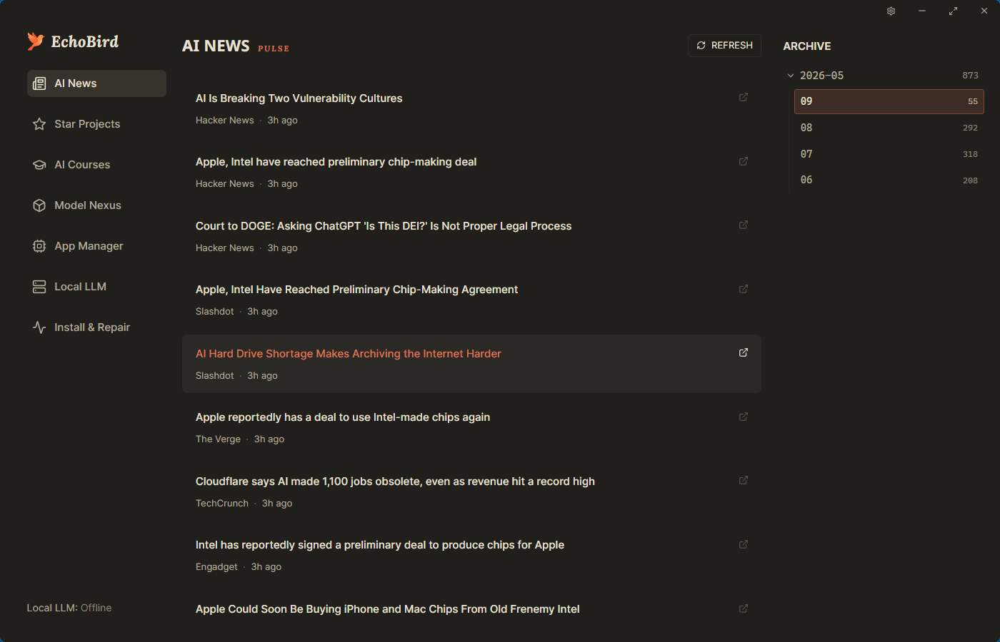
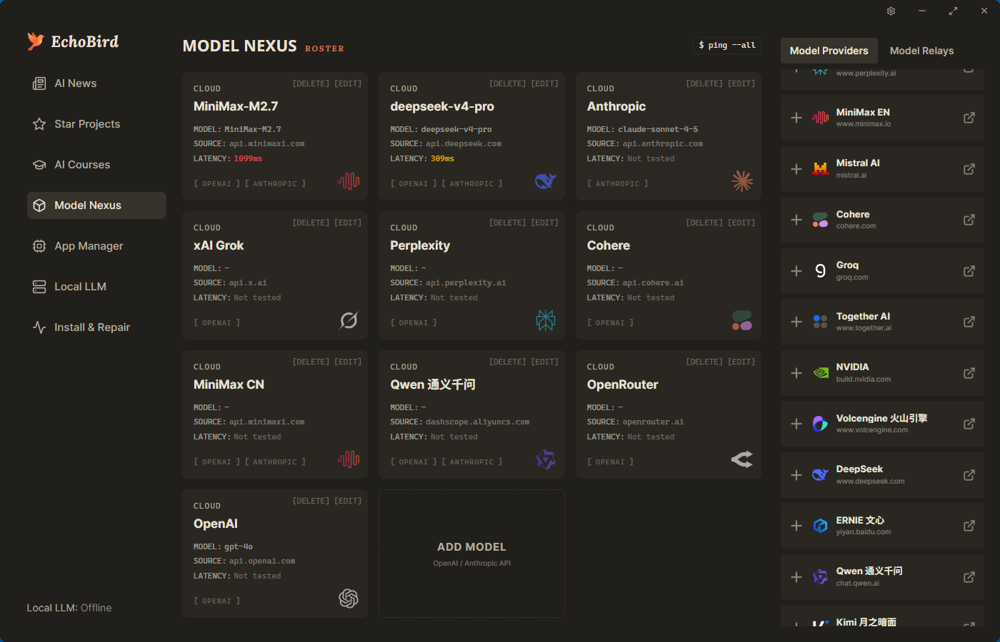
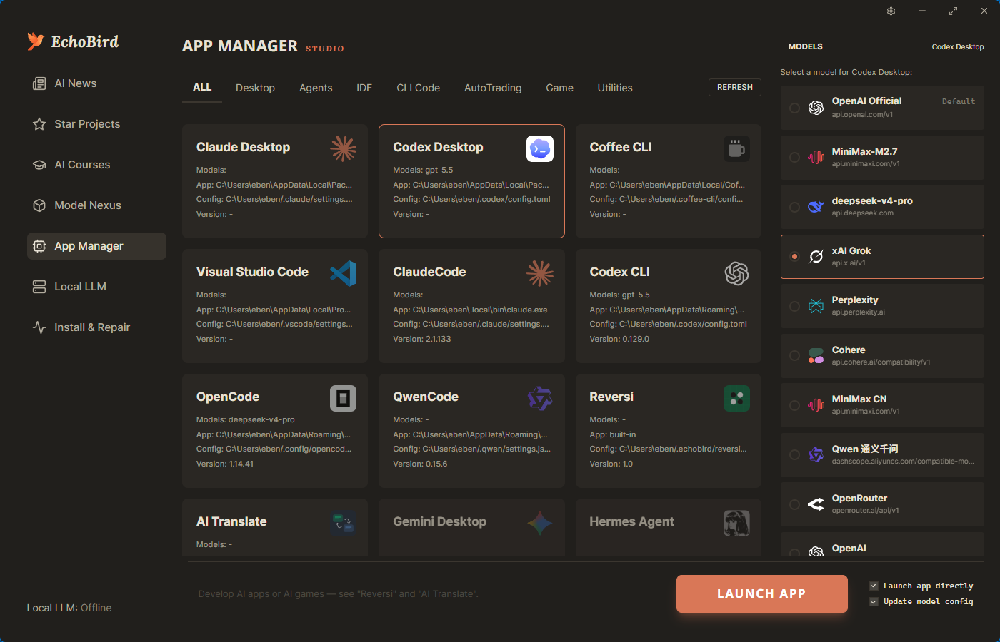
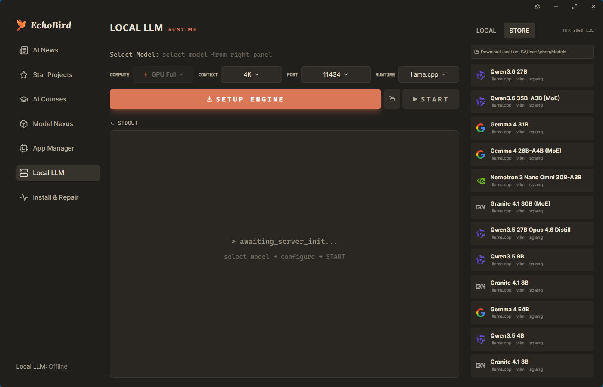
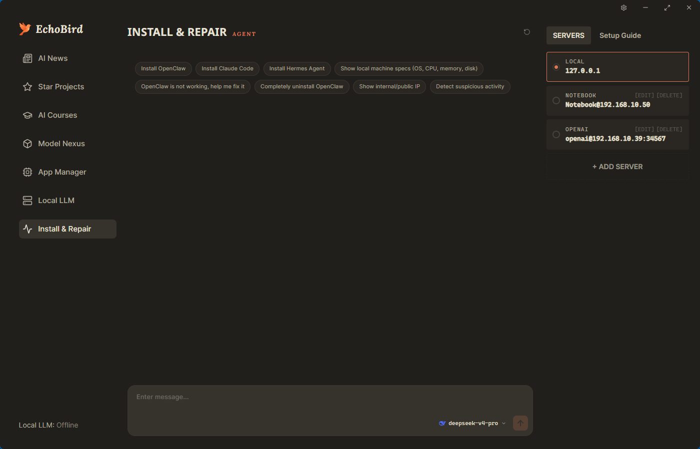

<p align="center">
  
</p>

<h1 align="center">EchoBird</h1>

<p align="center"><strong>AI deployment, no more chicken-and-egg.</strong></p>
<p align="center"><sub>AI 部署,不再是先有鸡还是先有蛋。</sub></p>

<p align="center">
  <a href="https://github.com/edison7009/EchoBird/releases">
    
  </a>
  
  
  
</p>

<p align="center">
  <a href="https://echobird.ai">Website</a> ·
  <a href="https://github.com/edison7009/EchoBird/releases/latest">Download</a> ·
  <a href="README.zh-CN.md">中文 README</a>
</p>

---

## What is EchoBird?

Friends kept asking me to install **Claude Code**, **OpenClaw**, **Hermes Agent** for them — every machine was different, and some refused to pay for an LLM. Setup and explanations took forever.

So I built **EchoBird** — an Agent inspired by the netrunner from *Cyberpunk 2077* who fixes any tech problem for V. EchoBird installs every AI tool with one click, points them at the model of your choice (cloud, local, or relay), and gets out of your way.

## Highlights

- **One-click install** for Claude Code, OpenClaw, Hermes Agent, and more
- **Bring your own model** — OpenAI / Anthropic / local LLMs / relays, all in one place
- **Speed-test every model** in one click before you commit
- **Local LLM runtime** built in — pick a quant, hit START
- **Install & Repair Agent** — talk to it like a colleague when something breaks
- **Cross-platform** — Windows, macOS, Linux (x64 + arm64)

## Screenshots

<table>
<tr>
  <td width="50%"></td>
  <td width="50%"></td>
</tr>
<tr>
  <td align="center"><sub>AI News & Star Projects</sub></td>
  <td align="center"><sub>Model Nexus — manage & speed-test models</sub></td>
</tr>
<tr>
  <td width="50%"></td>
  <td width="50%"></td>
</tr>
<tr>
  <td align="center"><sub>App Manager — one-click launch</sub></td>
  <td align="center"><sub>Local LLM — run models on your machine</sub></td>
</tr>
<tr>
  <td colspan="2"></td>
</tr>
<tr>
  <td colspan="2" align="center"><sub>Install & Repair — chat-driven setup and troubleshooting</sub></td>
</tr>
</table>

## Install

### One-line install

**Windows** (PowerShell)

```powershell
irm https://echobird.ai/install.ps1 | iex
```

**macOS / Linux**

```sh
curl -fsSL https://echobird.ai/install.sh | sh
```

The script auto-detects your OS, downloads the right package, and skips if you're already on the latest version.

### Or download a package

Latest release → <https://github.com/edison7009/EchoBird/releases/latest>

| Platform | Asset |
|---|---|
| Windows x64 | `EchoBird_<ver>_Windows_x64-setup.exe` |
| macOS (Apple Silicon) | `EchoBird_<ver>_macOS_arm64.dmg` |
| Linux x64 · Debian/Ubuntu | `EchoBird_<ver>_Linux_x64.deb` |
| Linux arm64 · Debian/Ubuntu | `EchoBird_<ver>_Linux_arm64.deb` |
| Linux x64 · Fedora/RHEL | `EchoBird_<ver>_Linux_x64.rpm` |
| Linux arm64 · Fedora/RHEL | `EchoBird_<ver>_Linux_arm64.rpm` |

## License

MIT — see [LICENSE](LICENSE).

---

<p align="center">
  Made with 💚 by EchoBird Team<br>
  <sub>⭐ <a href="https://github.com/edison7009/EchoBird">Star on GitHub</a> · <a href="README.zh-CN.md">中文文档</a></sub>
</p>
