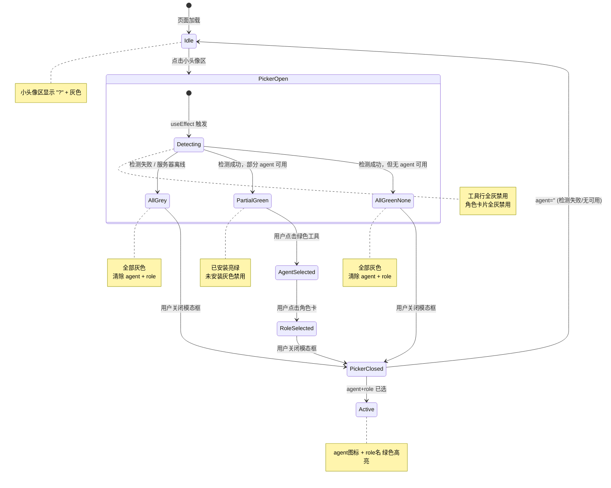

# 频道页完整技术手册

> 频道页（Channels Page）的全部行为规范、角色选择器状态机、各 Agent 角色配置参考。
> 合并自 27/28/30 号文档，作为频道页开发和修 BUG 的唯一参考。

---

## 目录

1. [架构概览](#架构概览)
2. [命名定义](#命名定义)
3. [初始状态流程](#初始状态流程)
4. [角色选择器状态机](#角色选择器状态机)
5. [检测期间 UI 规则](#检测期间的-ui-规则)
6. [数据持久化规则](#数据持久化规则)
7. [小头像区显示逻辑](#小头像区显示逻辑)
8. [大头像区显示逻辑](#大头像区显示逻辑)
9. [各 Agent 角色配置](#各-agent-角色配置)
10. [发送消息验证链](#发送消息验证链)
11. [已知 BUG 修复记录](#已知-bug-修复记录)
12. [远程模型切换](#远程模型切换)
13. [TODO](#todo)

---

## 架构概览

```
Channels Page (React)
  ├── ChannelsPanel (右侧面板 — 服务器列表/大头像区)
  ├── ChannelsMain (主区域 — 聊天 + 输入)
  │     ├── 聊天区 (flex-1 min-h-0 overflow-y-auto)
  │     ├── 角色选择条/小头像区 (flex-shrink-0)
  │     └── 输入区 (flex-shrink-0)
  └── AgentRolePicker (模态框 — 工具 + 角色选择)

通信方式:
  Local channel  → Tauri cmd: bridge_start / bridge_chat_local / bridge_set_role_local
  Remote channel → Tauri cmd: bridge_chat_remote / bridge_set_role_remote / bridge_detect_agents_remote
  Protocol:        stdin/stdout JSON via Bridge binary (NOT WebSocket)
```

### 涉及组件

| 组件 | 文件 | 职责 |
|------|------|------|
| 小头像区 | `Channels.tsx` | 显示当前 agent + role；点击打开 Picker |
| 角色选择器 | `AgentRolePicker.tsx` | 模态框：检测 agent、选择 agent、选择 role |
| 大头像区 | `ChannelsPanel.tsx` | 右侧服务器列表，头像/状态跟随小头像区 |

### 核心状态变量

| 变量 | 位置 | 类型 | 说明 |
|------|------|------|------|
| `detecting` | Picker 内部 | boolean | 工具检测是否进行中 |
| `agentStatuses` | Picker 内部 | AgentStatus[] | 各 agent 安装状态 |
| `localSelected` | Picker 内部 | string \| null | 当前选中的角色 id |
| `allActiveAgents[channelKey]` | Channels 上下文 | string | 当前频道选中的 agent 名 |
| `selectedRoleForChannel` | Channels 上下文 | {id, name, filePath} | 当前频道选中的角色 |
| `bridgeConnectionStatus` | Channels 上下文 | string | 'standby' / 'connecting' / 'connected' / 'disconnected' |

### 数据来源

| 数据 | 来源 | 文件 |
|------|------|------|
| 服务器列表 | `ssh_servers.json` | `~/.echobird/config/ssh_servers.json` |
| 角色目录 | `scan_roles` Tauri command | `roles/*.json` |
| Agent 检测 | `detect_local_agents` (本地) / `bridge_detect_agents_remote` (远程) | scan_tools() / SSH → Bridge |
| 聊天记录 | `useChatPersistence` hook | `~/.echobird/channel_history/` |

---

## 命名定义

| 名称 | 位置 | 说明 |
|------|------|------|
| **小头像区** | 输入框上方 | 角色/Agent 选择按钮 — 点击打开 AgentRolePicker |
| **大头像区** | 右侧面板 | 服务器列表 — 显示头像 + 状态 |

---

## 初始状态流程

### 新服务器添加

1. 用户在 Mother Agent 添加远程服务器
2. Channels 页收到 `ssh-servers-changed` 事件 → 刷新服务器列表
3. 新服务器在大头像区出现：灰色 `?` + `[Standby]`
4. 用户点击新服务器 → 成为活跃频道
5. 小头像区显示：灰色 `?` + `t('channel.selectRoleAgent')`
6. 用户点击小头像区 → 打开 AgentRolePicker

### 返回用户流程

用户此前已连接、选择过工具和角色。次日返回 Channels 页。

**页面加载**：agent/role 选择不保存，所有频道从 `?` 初始状态开始。

---

## 角色选择器状态机



### 时序图

```
用户点击小头像区
  │
  ├─ setShowRolePicker(true)
  │
  ▼
AgentRolePicker useEffect (isOpen=true)
  │
  ├─ setDetecting(true)           ← 工具行全灰
  ├─ api.scanRoles(locale)        ← 加载角色列表
  ├─ [远程] api.bridgeDetectAgentsRemote(serverId)
  ├─ [本地] api.detectLocalAgents()  ← 复用 scan_tools()
  │
  ├─── [失败] ────────────────────────────────────┐
  │    setAgentStatuses(全部 not installed)        │
  │    onSelectAgent('')                           │
  │    onSelectRole('', '', '')                    │
  │    setDetecting(false)                         │
  │                                                │
  ├─── [成功, 有可用] ──────────────────────┐      │
  │    setAgentStatuses([...mapped])        │      │
  │    setDetecting(false)                  │      │
  │    工具行亮起已安装                     │      │
  │                                         │      │
  ├─── [成功, 全不可用] ──────────────┐     │      │
  │    onSelectAgent('')             │     │      │
  │    onSelectRole('', '', '')      │     │      │
  │    setDetecting(false)           │     │      │
  │                                   │     │      │
  ▼                                   │     │      │
用户选择工具 → onSelectAgent(name)   │     │      │
用户选择角色 → onSelectRole(...)     │     │      │
用户关闭 → setShowRolePicker(false)  │     │      │
                                      │     │      │
           ┌──────────────────────────┘─────┘──────┘
           ▼
  小头像区: 有 agent → 绿色显示 | 无 agent → "?" 灰色
```

### 打开 Picker 的 7 种场景

| # | 场景 | SSH | 检测结果 | 工具行 | 角色区 | 关闭后小头像 |
|---|------|-----|---------|--------|--------|-------------|
| 1 | 首次打开，服务器在线，有工具 | ✅ | 部分安装 | 已安装亮，未安装灰 | 可选 | agent + role |
| 2 | 首次打开，服务器在线，无工具 | ✅ | 全未安装 | 全灰 | 全灰 | "?" |
| 3 | 首次打开，服务器离线 | ❌ | 失败 | 全灰 | 全灰 | "?" |
| 4 | 二次打开，已有 agent，服务器在线 | ✅ | 部分安装 | 保持上次选中 | 可选 | 保持 |
| 5 | 二次打开，已有 agent，服务器离线 | ❌ | 失败 | 全灰 | 全灰 | "?" (清除) |
| 6 | 本地频道，有本地工具 | N/A | 本地检测 | 已安装亮 | 可选 | agent + role |
| 7 | 本地频道，无本地工具 | N/A | 本地检测 | 全灰 | 全灰 | "?" |

---

## 检测期间的 UI 规则

> [!CAUTION]
> 历史 BUG：`detecting ? true` 让检测中所有工具默认可用。
> **正确行为**：`detecting ? false`，检测中全灰，完成后按结果亮起。

| 阶段 | 工具行 | 角色卡 | 无角色卡 |
|------|--------|--------|---------|
| 检测中 (`detecting=true`) | **全灰，不可点** | **全灰，不可点** | 灰色 |
| 检测完成，有可用 | 可用亮绿，不可用灰 | 可选 | 可选 |
| 检测完成，全不可用 | 全灰 | 全灰 | 灰色 |
| 检测失败 | 全灰 | 全灰 | 灰色 |

### 检测逻辑统一

本地和远程检测使用相同标准：`detect_local_agents()` 内部调用 `scan_tools()`（App Manager 同款），具备 `requireConfigFile`、平台路径、config dir 等完整 5 步验证。

---

## 数据持久化规则

> [!IMPORTANT]
> agent/role 选择 **不保存 localStorage**。每次刷新从 "?" 开始。

| 数据 | 持久化 | 原因 |
|------|--------|------|
| 聊天记录 | ✅ 文件 | 用户对话内容需要保留 |
| agent 选择 | ❌ 仅内存 | 服务器状态随时变化 |
| role 选择 | ❌ 仅内存 | 跟随 agent 管理 |
| 频道列表 | ✅ ssh_servers.json | 用户主动配置 |

---

## 小头像区显示逻辑

```
if (allActiveAgents[channelKey] 有值) {
    if (selectedRoleForChannel 有值) {
        显示: agent图标 + role名称    样式: 绿色
    } else {
        显示: agent图标 + agent名称   样式: 绿色
    }
} else {
    显示: "?" + "Select Role and Agent"  样式: 灰色
}
```

> [!IMPORTANT]
> 工具选中（有或没有角色）= 绿色高亮。灰色仅出现在真正的初始状态。

---

## 大头像区显示逻辑

### 频道构建
1. **本地频道** (id=1): 始终存在，地址 `127.0.0.1`
2. **远程频道** (id=2+): 每个 SSH 服务器一个
3. 频道列表在 `ssh-servers-changed` 事件时刷新

### 卡片状态

| 状态 | 头像 | 状态文本 |
|------|------|---------|
| 初始（无工具） | 灰色 `?` | `[Standby]` |
| 工具已选，无角色 | Agent 图标 | `[Standby] Agent名` |
| 工具 + 角色 | Agent 图标 | `[Standby] Role名` |
| 已连接 | Agent 图标 | `[Linked] Role/Agent名` |
| 连接中 | Agent 图标 | `[Connecting]` |
| 错误 | Agent 图标 | `[Failed]` |

---

## 各 Agent 角色配置

### 角色来源 URL

| 优先级 | 语言 | URL |
|--------|------|-----|
| 主要 | English | `https://echobird.ai/roles/en/{filePath}` |
| 主要 | Chinese | `https://echobird.ai/roles/zh-Hans/{filePath}` |
| 备用 | English | `https://raw.githubusercontent.com/.../roles/en/{filePath}` |
| 备用 | Chinese | `https://raw.githubusercontent.com/.../roles/zh-Hans/{filePath}` |

### 角色切换架构

```
用户选择角色 → bridge_set_role_local(agentId, roleId, roleUrl)
  → stdio-json (OpenClaw): Bridge 下载 .md → 写入 agent 配置目录
  → cli-oneshot (其他): Rust 下载 .md → 写入 agent 配置目录 + 存 ONESHOT_STATE
发送消息时:
  → stdio-json: Bridge 在 session 启动时读 SOUL.md
  → cli-oneshot: Rust 通过 CLI flag 或消息注入角色
```

### 各 Agent 详细配置

| Agent | 协议 | 角色文件 | 共享? | 覆写? | 注入方式 | Session 重置? |
|-------|------|---------|-------|-------|---------|--------------|
| OpenClaw | stdio-json | `~/.openclaw/workspace/SOUL.md` | YES | 始终 | Agent 读 session start | **YES** |
| Claude Code | cli-oneshot | `~/.claude/agents/{role_id}.md` | NO | 按需 | `--system-prompt-file` | 角色时跳过 resume |
| ZeroClaw | cli-oneshot | `~/.zeroclaw/.../skills/{id}/SKILL.md` | NO | 按需 | 消息前置 | NO |
| NanoBot | cli-oneshot | `~/.nanobot/workspace/AGENTS.md` | YES | 始终 | Agent 自动读 | NO |
| PicoClaw | cli-oneshot | `~/.picoclaw/workspace/AGENT.md` | YES | 始终 | Agent 自动读 (mtime) | NO |
| Hermes | cli-oneshot | `~/.hermes/SOUL.md` | YES | 始终 | Agent 每次 chat 自动读 | NO |

> [!CAUTION]
> - **OpenClaw**: 默认 SOUL.md 存在时必须覆写，否则角色永不生效
> - **Claude Code**: `--resume` 会忽略 `--system-prompt-file`，角色激活时跳过 resume
> - **Claude Code**: **不要用** `--agent` flag，会导致 CLI 挂起
> - **PicoClaw**: 消息前置不生效，必须写入 `AGENT.md`

### 代码位置

| 文件 | 职责 |
|------|------|
| `bridge-src/src/main.rs` | `handle_set_role()`, `handle_clear_role()` |
| `channel_commands.rs` | `bridge_set_role_local()`, `download_role_file_direct()`, `bridge_chat_oneshot()` |
| `Channels.tsx` | 角色去重 (`${agentId}:${role.id}`)，session 重置 |
| `plugins/{agent}/plugin.json` | CLI 参数、session resume 配置 |

---

## 发送消息验证链

### Local Channel

```
发送 → bridge_start(如未运行) → bridge_set_role_local(如有角色变化) → bridge_chat_local
```

### Remote Channel

```
发送
  ├─ Step 1: bridgeDetectAgentsRemote (缓存)
  │   └─ agent 未安装 → error "Agent not installed"
  ├─ Step 2: bridgeStartAgentRemote (如未运行)
  │   └─ 失败 → 非致命 warn
  ├─ Step 3: bridgeSetRoleRemote (如有角色且变化)
  │   └─ 失败 → 非致命 warn
  ├─ Step 4: bridgeChatRemote
  │   └─ 失败 → error 显示在聊天中
  └─ 成功 → 显示 assistant 消息
```

---

## Agent 工具列表

所有 agent 平等对待 — 无硬编码默认值。显示顺序由 `AGENT_TOOLS` 数组决定。

| Agent | ID | CLI Command |
|-------|----|-------------|
| OpenClaw | `openclaw` | `openclaw` |
| Claude Code | `claudecode` | `claude` |
| ZeroClaw | `zeroclaw` | `zeroclaw` |
| NanoBot | `nanobot` | `nanobot` |
| PicoClaw | `picoclaw` | `picoclaw` |
| Hermes Agent | `hermes` | `hermes` |

> [!IMPORTANT]
> 添加新 agent 需更新 3 个文件：`AGENT_LIST` (Channels.tsx)、`AGENT_TOOLS` (AgentRolePicker.tsx)、`AGENT_TOOL_IDS` (role_commands.rs)。见 workflow `/add-agent` Step 5。

---

## 已知 BUG 修复记录

| BUG | 根因 | 修复 | 版本 |
|-----|------|------|------|
| 打开 Picker 瞬间工具全可点 | `detecting ? true` | 改为 `detecting ? false` | 568710f |
| 关闭后恢复旧 agent | localStorage 缓存 | 移除 localStorage 读写 | 568710f |
| 检测失败后小头像不回 "?" | 只清了 role 没清 agent | 加 `onSelectAgent('')` | 568710f |
| 消息被角色选择条遮挡 | 角色条嵌套在输入框 div | 分离为独立 flex-shrink-0 | 15a0601 |
| 卸载工具仍显示已安装 | `detect_local_agents` 只用 where.exe | 复用 `scan_tools()` | cf39112 |
| 本地检测 catch 未清除选择 | catch 只做 setDetecting(false) | 加清除 agent/role | 01a8281 |
| 无角色卡 agent 不可用时仍可点 | 缺少 `currentAgentAvailable` 守卫 | 加守卫 | 01a8281 |
| Claude Code --resume 忽略角色 | --resume + --system-prompt-file 冲突 | 角色时跳过 resume | 2026-03-20 |
| 工具切换无效 | bridgeConnectionStatus 未重置 | bridgeStop() + 重置 | 2026-03-20 |
| 跨协议状态冲突 | 切换协议时旧状态残留 | bridge_start 清除对方状态 | 2026-03-20 |
| 远程频道角色 URL 错误 | 用了 echobird.ai (返回 HTML) | 改用 raw.githubusercontent.com | 2026-03-20 |
| 角色去重只看 role.id | 切换 agent 后角色不重新应用 | 改为 `${agentId}:${role.id}` | 2026-03-20 |
| 角色下载失败静默吞错 | 后端未清 active_role_id | 清除 + 错误传播到前端 | 2026-03-20 |
| remoteAgentCache 工具切换不失效 | 缓存未删除 | onSelectAgent 删缓存 | 2026-03-20 |

---

## 远程模型切换

> 此节记录远程模型切换的**整体业务逻辑和界面设计**。
> 各 Agent 具体打通细节在 `29.远程模型切换设计方案.md` 中，逐个 Agent 实施时再完善。

### 前置条件

远程模型切换依赖两个前提：
1. **SSH 已连接** — 服务器在线
2. **Agent 已选中** — 用户在 AgentRolePicker 中选了一个已安装的 Agent

> [!IMPORTANT]
> **仅远程频道显示模型选择器**。本地频道的模型通过 App Manager 配置，不在频道页重复。
> 本地频道进入后仍需选择 Agent + Role（流程不变），但不显示模型选择器。

### Bridge 自动部署策略

远程操作（检测 Agent、设置角色、发消息）都依赖 Bridge 二进制文件在远程服务器上。
采用**三层验证**策略，保证每个入口都有 Bridge：

| 时机 | 触发场景 | 代码位置 |
|------|---------|---------|
| 1. 添加服务器 | Mother Agent 首次 SSH 连接成功 | `ssh_commands.rs`（新增） |
| 2. 打开 Picker | 检测远程 Agent 安装状态 | `bridge_detect_agents_remote()`（新增） |
| 3. 发消息/设角色 | 远程聊天 / 远程设置角色 | `bridge_chat_remote()` / `bridge_set_role_remote()`（已有） |

> [!NOTE]
> 后端有 `REMOTE_BRIDGE_VERIFIED` 缓存（HashSet），同一 session 内首次验证后只做内存查询，重复检查零开销。
> 验证流程：检查远程 Bridge 版本 → 版本匹配则缓存跳过 → 缺失或旧版则 base64 上传 + chmod + symlink。

**需要改的代码**：
1. `bridge_detect_agents_remote()` — 开头加 `ensure_remote_bridge(&pool, &server_id).await?`
2. Mother Agent 添加服务器流程 — SSH 连接成功后调 `ensure_remote_bridge`

### 业务流程

```
用户选择远程频道 → SSH 连接成功 → 选择 Agent（AgentRolePicker）→ 关闭 Picker
  ↓
回到频道页 → 模型按钮显示加载动画 + 发送按钮锁定
  ↓
SSH 读取远程 Echobird 模型数据
  ├─ 读取成功 → 显示 "模型名 ▾" + 发送按钮解锁
  └─ 读取失败/无数据 → 显示 "Select model... ▾" + 发送按钮解锁
  ↓
用户点击模型下拉 → 弹出模型列表（来自 Model Nexus，需解密）→ 选择新模型
  ↓
模型按钮显示加载动画 + 发送按钮锁定
  ↓
SSH 写入远程配置
  ├─ 成功 → 显示 "新模型名 ▾" + 发送按钮解锁
  └─ 失败 → 回退旧状态 + 发送按钮解锁 + 显示错误
```

### UI 位置：发送按钮左侧（仅远程频道）

```
┌──────────────────────────────────────────────────────┐
│  输入消息...                                         │
│                                                      │
│  📎  📋                      [MiniMax-M2.7 ▾]  [▷] │
└──────────────────────────────────────────────────────┘
```

**按钮样式**：纯文字 + `▾` 箭头，无背景无边框。hover 时显示柔和背景（无边框）。

**下拉菜单样式**：
- **方向**：向上弹出（按钮在屏幕底部附近）
- **背景**：柔和深色背景（`bg-cyber-bg` 或类似），无边框
- **当前模型**：右侧显示 ✓ 勾选标记
- **hover 效果**：条目 hover 时显示柔和高亮背景
- **动画**：平滑展开/收起
- **数据来源**：Model Nexus 已配置的模型（加密存储，读取时需解密）
- **空列表**：未配置模型时，提示前往 Model Nexus 添加

参考 Claude / Codex 模型选择器的设计风格。

### UI 状态机

| 状态 | 模型按钮显示 | 发送按钮 | 触发条件 |
|------|------------|---------|---------|
| 未选 Agent | 不显示 | ✅ 可用（发送后提示 `error.agentFailed`） | — |
| 读取中 | ⟳ 加载动画 | 🔒 锁定 | Agent 选好、关闭 Picker 时 |
| 未选模型 | `mother.selectModel` ▾ | ✅ 可用（发送后提示 `error.noModelSelected`） | 读取失败/无数据/从未通过 Echobird 设置过 |
| 已有模型 | `模型名 ▾` | ✅ 解锁 | 读取到 Echobird 写入的模型数据 |
| 切换中 | ⟳ 加载动画 | 🔒 锁定 | 用户在下拉列表中点选新模型 |
| 切换完成 | `新模型名 ▾` | ✅ 解锁 | SSH 写入成功 |
| 切换失败 | 回退旧状态 | ✅ 解锁 | SSH 写入失败 |

### 边界情况处理

| 场景 | 处理 |
|------|------|
| 切换 Agent | 模型状态重置 → 重新执行"读取中"流程 |
| 切换频道 | 每个频道模型状态独立（`per-channel state`） |
| 重启软件 | 所有频道回到未连接初始状态，模型选择器自然不显示 |
| 本地频道 | 不显示模型选择器（本地走 App Manager 配模型） |
| SSH 超时/断连 | 解锁发送按钮 + 回退旧状态 + 显示错误提示 |
| 读不到模型 | 一律显示 `mother.selectModel`，用户不选就提示 `error.noModelSelected` |
| 用户用其他软件改了模型 | 与 Echobird 无关，我们只管自己写入的数据 |
| 模型列表为空 | 下拉中提示前往 Model Nexus 添加 |

> [!IMPORTANT]
> **设计原则**：
> 1. **不打断用户惯性** — 未选 Agent 或未选模型时发送按钮可用，发送后收到错误提示
> 2. **读不到 = 请选择** — 不尝试解析 Agent 原生默认模型，读取失败一律显示"Select model..."
> 3. **复用 i18n key** — `mother.selectModel` + `error.noModelSelected`，零新增多语言
> 4. **模型数据加密** — Model Nexus 的模型数据加密存储，读取时需解密后再传递给 SSH 命令
> 5. **模型切换与发消息完全正交** — 模型读取/写入期间发送按钮已锁定，不存在竞争。发送按钮解锁后，`handleSend` 走原有流程（检查 Bridge、下载角色等），无需任何模型切换相关判断

### 触发修改的时机

| 方式 | 采用 | 理由 |
|------|------|------|
| 下拉选择后立即 SSH 写入 | ✅ | 选完即改，操作最直接 |
| 点击确定按钮 | ❌ | 多一步操作，不如立即生效简洁 |
| 用户发消息时 | ❌ | 发送按钮已承载消息+角色，不应再加模型切换 |
| 关闭界面时 | ❌ | 无明确意图，容易误触发 |

### 各 Agent 远程配置读写汇总

> 远程操作全部通过 SSH 执行，不涉及本地打补丁。

| Agent | 配置文件 | 格式 | SSH 读取命令 | SSH 写入方式 |
|-------|---------|------|-------------|-------------|
| Hermes | `~/.hermes/config.yaml` | YAML | `hermes config get model` | `hermes config set model <m> && hermes config set OPENAI_API_KEY <k> && hermes config set OPENAI_BASE_URL <u>` |
| OpenClaw | `~/.openclaw/openclaw.json` | JSON | `cat ~/.openclaw/openclaw.json` | 整体 JSON 写入（需构建自定义 provider） |
| ZeroClaw | `~/.zeroclaw/config.toml` | TOML | `grep "default_model" ~/.zeroclaw/config.toml` | `echo 'toml内容' > ~/.zeroclaw/config.toml` |
| NanoBot | `~/.nanobot/config.json` | JSON | `cat ~/.nanobot/config.json` | `echo 'json内容' > ~/.nanobot/config.json` |
| PicoClaw | `~/.picoclaw/config.json` | JSON | `cat ~/.picoclaw/config.json` | `echo 'json内容' > ~/.picoclaw/config.json` |
| OpenFang | `~/.openfang/config.toml` | TOML | `grep "model" ~/.openfang/config.toml` | `echo 'toml内容' > ~/.openfang/config.toml` |

### OpenClaw 特殊处理

OpenClaw 不能用 `openclaw config set agents.defaults.model.primary model_name` 直接设模型，
因为 Echobird 需要注册 **自定义 Provider**（包含 `baseUrl`、`apiKey`、`api` 协议类型）。

本地采用"打补丁"思路：注入 JS 到 `openclaw.mjs`，启动时自动写入 `~/.openclaw/openclaw.json`。
远程不需要打补丁——直接通过 SSH 写入 `~/.openclaw/openclaw.json`，手动构建 `eb_xxx` Provider：

```jsonc
// ~/.openclaw/openclaw.json 的关键结构
{
  "models": {
    "providers": {
      "eb_deepseek": {                    // 自定义 provider 名
        "baseUrl": "https://api.deepseek.com",
        "apiKey": "sk-xxx",
        "api": "openai-completions",      // 或 "anthropic-messages"
        "models": [{
          "id": "deepseek-chat",
          "name": "deepseek-chat",
          "contextWindow": 128000,
          "maxTokens": 8192,
          "input": ["text"],              // v2026.3.11+ 必须
          "reasoning": false,             // v2026.3.11+ 必须
          "cost": { "input": 0, "output": 0, "cacheRead": 0, "cacheWrite": 0 }
        }]
      }
    }
  },
  "agents": {
    "defaults": {
      "model": {
        "primary": "eb_deepseek/deepseek-chat"  // provider/modelId
      }
    }
  }
}
```

> [!CAUTION]
> - OpenClaw v2026.3.11+ 移除了 `auth`、`authHeader` 字段，model 对象必须含 `input`、`reasoning`
> - 写入不符合 schema 的字段会被**静默丢弃**
> - 用 `eb_` 前缀命名 provider，避免与用户自有 provider 冲突

### 需要新增的后端命令

| 命令 | 方向 | 参数 | 返回 |
|------|------|------|------|
| `bridge_get_remote_model` | 前端→后端 | `server_id`, `agent_id` | `{ model_id, base_url? }` |
| `bridge_set_remote_model` | 前端→后端 | `server_id`, `agent_id`, `model_info` | `{ success, message }` |

---

## TODO

- [ ] 检测中显示 spinner 或 loading 动画（当前只是灰色，用户不知道在检测）
- [ ] 检测超时提示（当前依赖 SSH 15 秒超时，无 UI 反馈）
- [ ] 远程模型切换 — 后端命令实现（`bridge_get_remote_model` / `bridge_set_remote_model`）
- [ ] 远程模型切换 — 前端 UI（模型选择区域 + 加载状态 + 确认按钮）
- [ ] 远程模型切换 — 逐个 Agent 打通（优先 Hermes，其次 OpenClaw）
